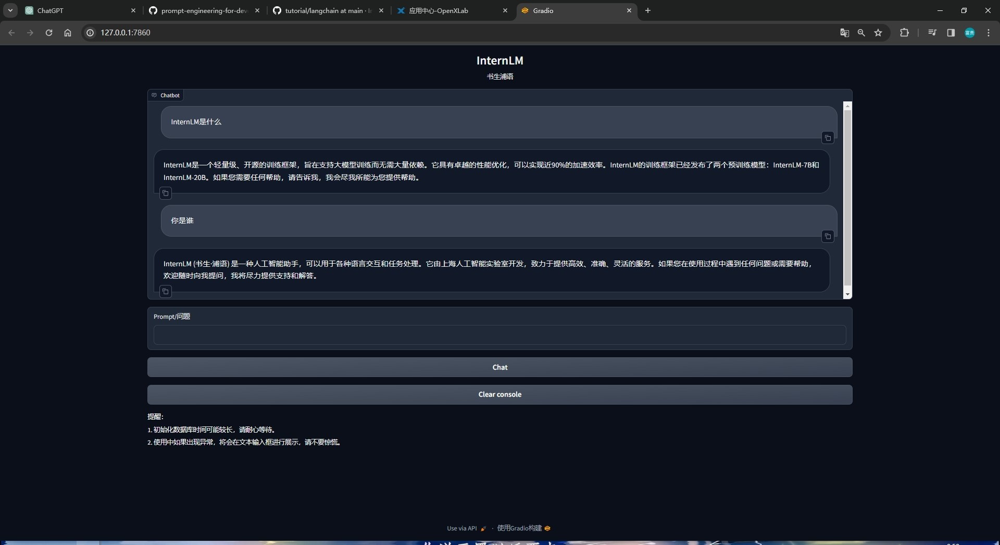

# 基于InternLM和LangChain搭建你的知识库

# 1、大模型开发范式

## LLM的局限性

- 知识时效性受限：大模型只在确定的时间点训练，·会使用到大量的知识预料，因此具有丰富的知识储备，但是只包含训练时间点之前的知识，对于更新的知识，LLM是无法正确回答的。
- 专业能力有限：知识广度不错，但是在垂直领域表现一般。如何打造垂直领域大模型拥有广泛前景。
- 定制化成本高：如何打造个人专属LLM

为了解决其面临的局限性，目前有两种开发范式：

RAG(检索增强生成（Retrieval Augmented Generation）) & Finetune(微调)

- RAG核心思想是给大模型外挂一个知识库，提问首先会匹配知识库中的相关文档，然后一起交给生成回答。
- Finetune在一个新的较小的数据集上进行小的微调。

优缺点：

- RAG：优势：成本低，不需要GPU训练，可以实时更新。缺点：受基座模型影响大，占用了大量模型上下文所以单次回答知识有限，对于一些需要大跨度，总结性回答的问题表现不佳 。
- Finetune：优势：可以个性化微调，且知识覆盖面广，可以在个性化数据上微调，不断拟合个性化知识，尤其是对于非可视化知识。缺点：算力要求高，成本高昂，无法实时更新。

## RAG：检索增强生成


如图中所示，我们的应用首先会基于向量模型Sentence Transformer将输入文本转化为向量，然后在数据库中匹配相似的文本段（大概率包含问题的答案），然后将输入和检索到的相似文本段嵌入到模型的Prompt中传递给InternLM，然后模型做出最后的回答。

# 2、LangChain简介

LangChain是一个开源框架，旨在通过各种LLM提供通用接口来简化应用程序的开发流程，帮助开发者自由构建LLM应用。

LangChain封装了很多组件，通过这些组件的组合，可以构建多个类型的RAG应用。开发者可以将私域数据嵌入到LangChain中的组件，然后进行组合，构建适用于自己场景的RAG应用。

LangChain的核心组成模块：

- 链（Chains）：将组件组合实现端到端应用，通过一个对象封装实现一系列LLM操作。
- Eg.检索问答链，覆盖实现了RAG的全流程

## 基于LangChain搭建RAG应用


这幅图体现了如何基于LangChain来搭建RAG应用

首先，对于以本地问但存在的个人知识库，我们用Unstructed Loader来读取本地文档，这个组件会将所有本地文档转化为纯文本格式，然后通过TextSplitter组件，对提取出来的纯文本分割成Chunks，然后使用开源词向量模型SentenceTransformer将文本段转化为向量格式。存储到基于Chroma的数据库中，对于用户的输入，首先通过SentenceTransformer转化为同样维度的向量，通过数据库中相似度匹配，找到相关的文本段，嵌入到经写好的PromptTemplate中，然后交给InternLM进行回答。

# 3、构建向量数据库

向量数据库的构建主要有：加载源文件->文档分块->文档向量化三个部分


## 3.1加载源文件

我们要将所有示例中的Markdown、txt文件作为语料库，我们可以直接使用 `langchain.document_loaders`中的文件加载方法来得到纯文本对象。

```python

from tqdm import tqdm
from langchain.document_loaders import UnstructuredFileLoader
from langchain.document_loaders import UnstructuredMarkdownLoader

def get_text(dir_path):
    # args：dir_path，目标文件夹路径
    # 首先调用上文定义的函数得到目标文件路径列表
    file_lst = get_files(dir_path)
    # docs 存放加载之后的纯文本对象
    docs = []
    # 遍历所有目标文件
    for one_file in tqdm(file_lst):
        file_type = one_file.split('.')[-1]
        if file_type == 'md':
            loader = UnstructuredMarkdownLoader(one_file)
        elif file_type == 'txt':
            loader = UnstructuredFileLoader(one_file)
        else:
            # 如果是不符合条件的文件，直接跳过
            continue
        docs.extend(loader.load())
    return docs
```

## 3.2 构建向量数据库

同样，LangChain提供了多种文本分块工具，我们使用字符串递归分割器，也就是基于字符的分割方式，并选择分块大小为 500，块重叠长度为 150。除此之外，还有基于token的分割、基于Markdown的分割，更详细的分割说明可以看[《LangChain-Chat With Your Data》](https://github.com/datawhalechina/prompt-engineering-for-developers/blob/9dbcb48416eb8af9ff9447388838521dc0f9acb0/content/LangChain%20Chat%20with%20Your%20Data/3.%E6%96%87%E6%A1%A3%E5%88%86%E5%89%B2%20Splitting.ipynb)

```python
from langchain.text_splitter import RecursiveCharacterTextSplitter

text_splitter = RecursiveCharacterTextSplitter(
    chunk_size=500, chunk_overlap=150)
split_docs = text_splitter.split_documents(docs)
```

接着我们选用开源词向量模型 [Sentence Transformer](https://huggingface.co/sentence-transformers/paraphrase-multilingual-MiniLM-L12-v2) 来进行文本向量化，并选择 Chroma 作为向量数据库。基于上文分块后的文档以及加载的开源向量化模型，将语料加载到指定路径下的向量数据库。

```python
# 对文本进行分块
text_splitter = RecursiveCharacterTextSplitter(
    chunk_size=500, chunk_overlap=150)
split_docs = text_splitter.split_documents(docs)

# 加载开源词向量模型
embeddings = HuggingFaceEmbeddings(model_name="/root/data/model/sentence-transformer")

# 构建向量数据库
# 定义持久化路径
persist_directory = 'data_base/vector_db/chroma'
# 加载数据库
vectordb = Chroma.from_documents(
    documents=split_docs,
    embedding=embeddings,
    persist_directory=persist_directory  # 允许我们将persist_directory目录保存到磁盘上
)
# 将加载的向量数据库持久化到磁盘上
vectordb.persist()
```

## 3.3 InternLM接入LangChain

我们只需从 LangChain.llms.base.LLM 类继承一个子类，并重写构造函数与 `_call` 函数即可：

```python
from langchain.llms.base import LLM
from typing import Any, List, Optional
from langchain.callbacks.manager import CallbackManagerForLLMRun
from transformers import AutoTokenizer, AutoModelForCausalLM
import torch

class InternLM_LLM(LLM):
    # 基于本地 InternLM 自定义 LLM 类
    tokenizer : AutoTokenizer = None
    model: AutoModelForCausalLM = None

    def __init__(self, model_path :str):
        # model_path: InternLM 模型路径
        # 从本地初始化模型
        super().__init__()
        print("正在从本地加载模型...")
        self.tokenizer = AutoTokenizer.from_pretrained(model_path, trust_remote_code=True)
        self.model = AutoModelForCausalLM.from_pretrained(model_path, trust_remote_code=True).to(torch.bfloat16).cuda()
        self.model = self.model.eval()
        print("完成本地模型的加载")

    def _call(self, prompt : str, stop: Optional[List[str]] = None,
                run_manager: Optional[CallbackManagerForLLMRun] = None,
                **kwargs: Any):
        # 重写调用函数
        system_prompt = """You are an AI assistant whose name is InternLM (书生·浦语).
        - InternLM (书生·浦语) is a conversational language model that is developed by Shanghai AI Laboratory (上海人工智能实验室). It is designed to be helpful, honest, and harmless.
        - InternLM (书生·浦语) can understand and communicate fluently in the language chosen by the user such as English and 中文.
        """
  
        messages = [(system_prompt, '')]
        response, history = self.model.chat(self.tokenizer, prompt , history=messages)
        return response
  
    @property
    def _llm_type(self) -> str:
        return "InternLM"
```

其中构造函数会在对象实例化的开始执行，执行效果为加载本地的InternLM模型，LangChain 会调用 `_call`函数来调用LLM，用于和LLM进行交互。

在 `__init__` 方法中，通过给定的 `model_path` 参数，从本地加载 `InternLM` 模型。使用 `AutoTokenizer.from_pretrained` 和 `AutoModelForCausalLM.from_pretrained` 方法加载模型和相应的分词器。加载后，将模型转换为 `torch.bfloat16` 格式，并移到 GPU 上。最后，将模型设置为评估模式。

`_call`函数有以下几个参数：

* `prompt`: 一个字符串，表示用户提供的对话提示或问题。
* `stop`: 一个可选的字符串列表，表示在生成响应时应停止的条件。这在生成多轮对话时可能很有用。
* `run_manager`: 一个可选的回调管理器，可能用于处理与运行相关的操作。
* `**kwargs`: 允许传递任意其他关键字参数

函数主要的操作包括：

1. 定义了一个 `system_prompt`，其中包含有关AI助手的一些信息，例如其名称、开发者和设计目标。
2. 创建了一个 `messages`列表，其中包含一个元组，该元组包含系统提示和一个空字符串。这将用作模型聊天历史的起点。
3. 使用 `self.model.chat`方法，向语言模型提交用户提供的对话提示（`prompt`）和历史消息，以获取模型的响应和更新的历史。
4. 最后，返回从语言模型获得的响应。

我们将上述代码封装为 LLM.py，后续将直接从该文件中引入自定义的 LLM 类。

# 4、搭建知识库助手

## 将InternLM接入LangChain

- LangChain支持自定义LLM，可以直接接入到框架中。
- 只需要将InternLM部署在本地，并封装一个自定义的LLM类，调用本地InternLM即可。

## 构建检索问答链

- LangChain提供了检索问答链模板，可以自动实现知识检索、Prompt嵌入、LLM问答的全部流程
- 将基于InternLM的自定义LLM和已构建的向量数据库介入到检索问答链的上游
- 调用检索问答链，即可实现核心功能


可以调用 LangChain 提供的检索问答链构造函数，基于我们的自定义 LLM、Prompt Template 和向量知识库来构建一个基于 InternLM 的检索问答链：

```python
from langchain.chains import RetrievalQA

qa_chain = RetrievalQA.from_chain_type(llm,retriever=vectordb.as_retriever(),return_source_documents=True,chain_type_kwargs={"prompt":QA_CHAIN_PROMPT})
```

得到的 `qa_chain` 对象即可以实现我们的核心功能，即基于 InternLM 模型的专业知识库助手。我们可以对比该检索问答链和纯 LLM 的问答效果：

```python
# 检索问答链回答效果
question = "什么是InternLM"
result = qa_chain({"query": question})
print("检索问答链回答 question 的结果：")
print(result["result"])

# 仅 LLM 回答效果
result_2 = llm(question)
print("大模型回答 question 的结果：")
print(result_2)
```

## RAG方案优化建议

- 基于RAG的问答系统受限于：
  - 检索精度
  - Prompt性能
- 优化点：
  - 检索：
    - 基于语义进行分割，保证每一个chunk的语义完整，由于我们的检索是以chunk为单位检索的，如果部分chunk语义不完整，那么模型可能丢失一些信息。
    - 给每一个chunk生成概括性索引，检索时匹配索引
  - Prompt:
    - 迭代优化Prompt策略

# 5、WebDemo部署

基于Gradio 框架将其部署到 Web 网页

```python

from langchain.vectorstores import Chroma
from langchain.embeddings.huggingface import HuggingFaceEmbeddings
import os
from LLM import InternLM_LLM
from langchain.prompts import PromptTemplate
from langchain.chains import RetrievalQA

def load_chain():
    # 加载问答链
    # 定义 Embeddings
    embeddings = HuggingFaceEmbeddings(model_name="/root/data/model/sentence-transformer")

    # 向量数据库持久化路径
    persist_directory = 'data_base/vector_db/chroma'

    # 加载数据库
    vectordb = Chroma(
        persist_directory=persist_directory,  # 允许我们将persist_directory目录保存到磁盘上
        embedding_function=embeddings
    )

    # 加载自定义 LLM
    llm = InternLM_LLM(model_path = "/root/data/model/Shanghai_AI_Laboratory/internlm-chat-7b")

    # 定义一个 Prompt Template
    template = """使用以下上下文来回答最后的问题。如果你不知道答案，就说你不知道，不要试图编造答
    案。尽量使答案简明扼要。总是在回答的最后说“谢谢你的提问！”。
    {context}
    问题: {question}
    有用的回答:"""

    QA_CHAIN_PROMPT = PromptTemplate(input_variables=["context","question"],template=template)

    # 运行 chain
    qa_chain = RetrievalQA.from_chain_type(llm,retriever=vectordb.as_retriever(),return_source_documents=True,chain_type_kwargs={"prompt":QA_CHAIN_PROMPT})
  
    return qa_chain
```


