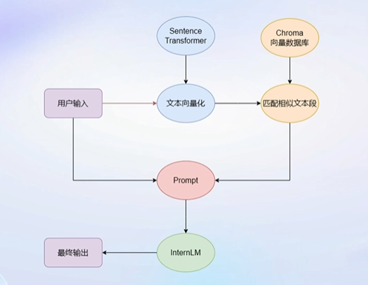
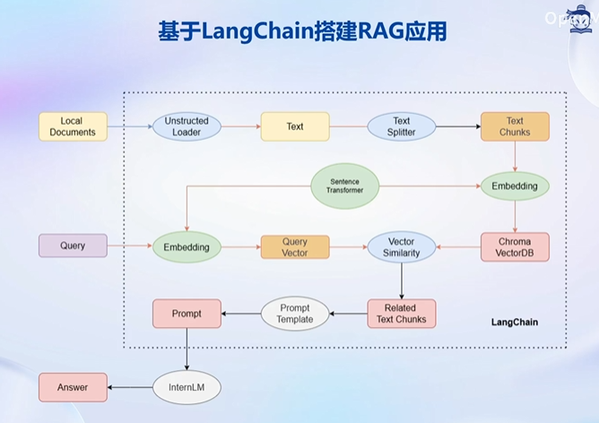
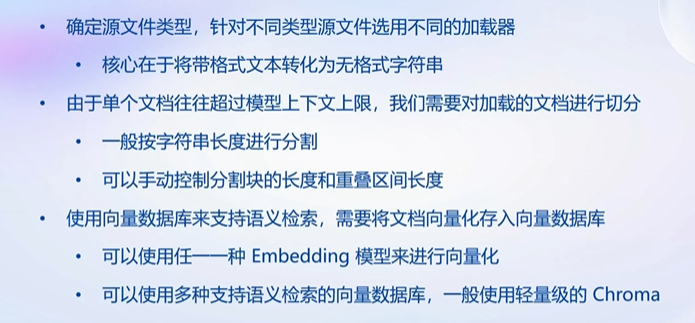
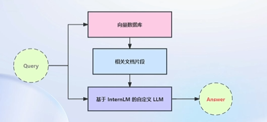

# 基于InternLM和LangChain搭建你的知识库

# 1、大模型开发范式

## LLM的局限性

- 知识时效性受限：大模型只在确定的时间点训练，·会使用到大量的知识预料，因此具有丰富的知识储备，但是只包含训练时间点之前的知识，对于更新的知识，LLM是无法正确回答的。
- 专业能力有限：知识广度不错，但是在垂直领域表现一般。如何打造垂直领域大模型拥有广泛前景。
- 定制化成本高：如何打造个人专属LLM

为了解决其面临的局限性，目前有两种开发范式：

RAG(检索增强生成（Retrieval Augmented Generation）) & Finetune(微调)

- RAG核心思想是给大模型外挂一个知识库，提问首先会匹配知识库中的相关文档，然后一起交给生成回答。
- Finetune在一个新的较小的数据集上进行小的微调。

优缺点：

- RAG：优势：成本低，不需要GPU训练，可以实时更新。缺点：受基座模型影响大，占用了大量模型上下文所以单次回答知识有限，对于一些需要大跨度，总结性回答的问题表现不佳 。
- Finetune：优势：可以个性化微调，且知识覆盖面广，可以在个性化数据上微调，不断拟合个性化知识，尤其是对于非可视化知识。缺点：算力要求高，成本高昂，无法实时更新。

## RAG：检索增强生成

如图中所示，我们的应用首先会基于向量模型Sentence Transformer将输入文本转化为向量，然后在数据库中匹配相似的文本段（大概率包含问题的答案），然后将输入和检索到的相似文本段嵌入到模型的Prompt中传递给InternLM，然后模型做出最后的回答。

# 2、LangChain简介

LangChain是一个开源框架，旨在通过各种LLM提供通用接口来简化应用程序的开发流程，帮助开发者自由构建LLM应用。

LangChain封装了很多组件，通过这些组件的组合，可以构建多个类型的RAG应用。开发者可以将私域数据嵌入到LangChain中的组件，然后进行组合，构建适用于自己场景的RAG应用。

LangChain的核心组成模块：

- 链（Chains）：将组件组合实现端到端应用，通过一个对象封装实现一系列LLM操作。
- Eg.检索问答链，覆盖实现了RAG的全流程

## 基于LangChain搭建RAG应用

这幅图体现了如何基于LangChain来搭建RAG应用

首先，对于以本地问但存在的个人知识库，我们用Unstructed Loader来读取本地文档，这个组件会将所有本地文档转化为纯文本格式，然后通过TextSplitter组件，对提取出来的纯文本分割成Chunks，然后使用开源词向量模型SentenceTransformer将文本段转化为向量格式。存储到基于Chroma的数据库中，对于用户的输入，首先通过SentenceTransformer转化为同样维度的向量，通过数据库中相似度匹配，找到相关的文本段，嵌入到经写好的PromptTemplate中，然后交给InternLM进行回答。

# 3、构建向量数据库

向量数据库的构建主要有：加载源文件->文档分块->文档向量化三个部分

# 4、搭建知识库助手

## 将InternLM接入LangChain

- LangChain支持自定义LLM，可以直接接入到框架中。
- 只需要将InternLM部署在本地，并封装一个自定义的LLM类，调用本地InternLM即可。

## 构建检索问答链

- LangChain提供了检索问答链模板，可以自动实现知识检索、Prompt嵌入、LLM问答的全部流程
- 将基于InternLM的自定义LLM和已构建的向量数据库介入到检索问答链的上游
- 调用检索问答链，即可实现核心功能

## RAG方案优化建议

- 基于RAG的问答系统受限于：
  - 检索精度
  - Prompt性能
- 优化点：
  - 检索：
    - 基于语义进行分割，保证每一个chunk的语义完整，由于我们的检索是以chunk为单位检索的，如果部分chunk语义不完整，那么模型可能丢失一些信息。
    - 给每一个chunk生成概括性索引，检索时匹配索引
  - Prompt:
    - 迭代优化Prompt策略

# 5、WebDemo部署
