# 基于 InternLM 和 LangChain 搭建你的知识库 作业

# 1.基础作业：

> 复现课程知识库助手搭建过程 (截图)

## 1、创建向量数据库

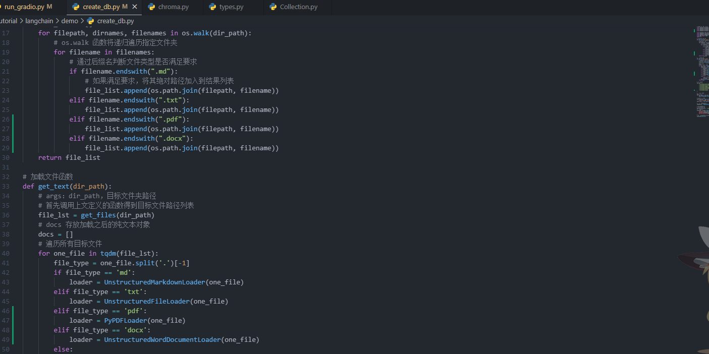

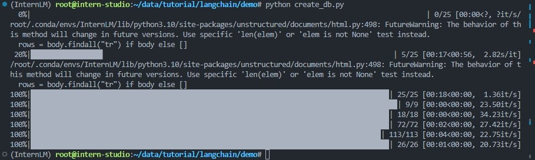

## 2、构建检索问答链并运行web_demo

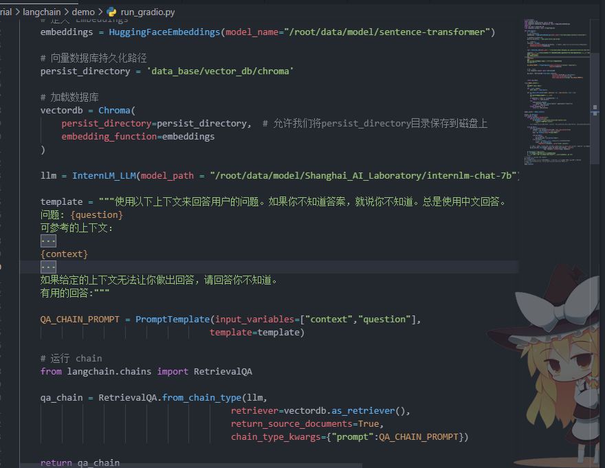

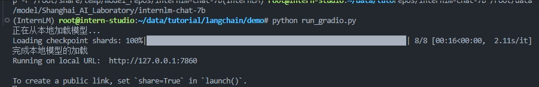

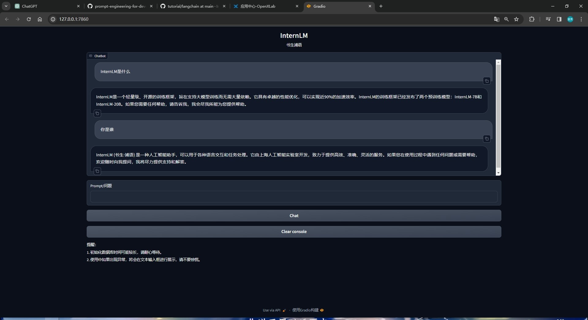

# 2.进阶作业

> 选择一个垂直领域，收集该领域的专业资料构建专业知识库，并搭建专业问答助手，并在 [OpenXLab](https://openxlab.org.cn/apps) 上成功部署（截图，并提供应用地址）

我想尝试实现一个命理学大模型，由于刚刚学习，很多功能实现会还不是很熟悉，所以目前只拿了一部分相关书籍作为数据库跑了一下，效果比较一般（哭，还没有部署到OpenXLab上，下面简单展示实现过程。

## 1、数据准备

以下是我准备的部分数据，部分文件要注意编码，txt文件需要改为UTF-8编码才能读取

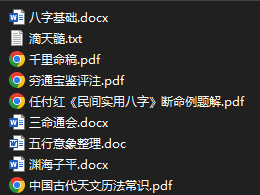

## 2、构建向量数据库

1、修改部分内容 `create_db.py`中的部分内容，使其兼容多种数据输入

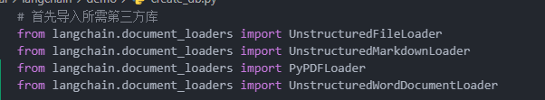

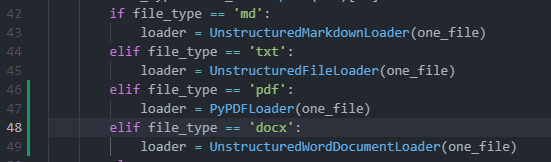

改好后运行脚本就可以获得获得向量数据库了。

## 3、部署Web Demo

不知道什么原因，总是显示乱码，得多输入几次才能正常显示。之后问了点基础知识，发现有不少错误的内容，相比gpt3.5还是差很远（当然这只是一个7b模型的小demo，之后会继续完善数据和Prompt以及其他的预处理。

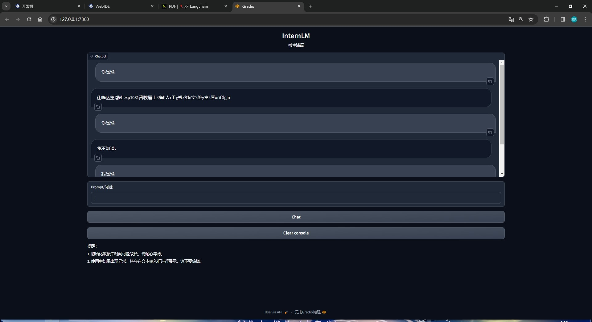

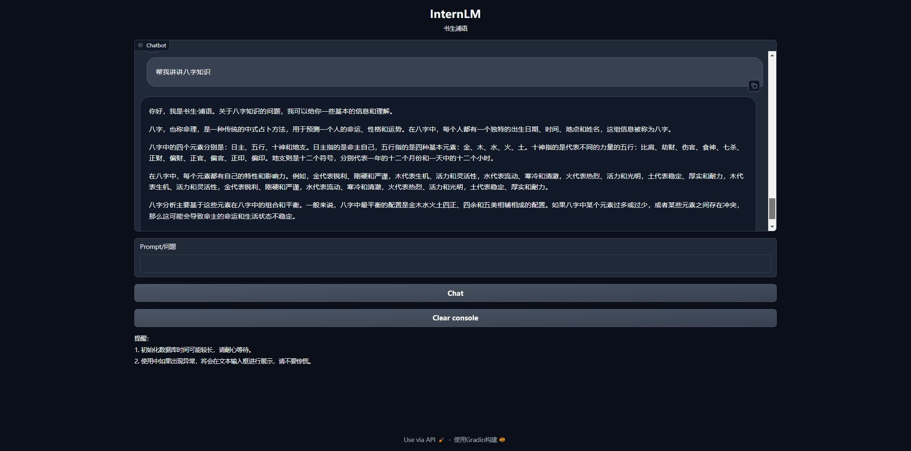

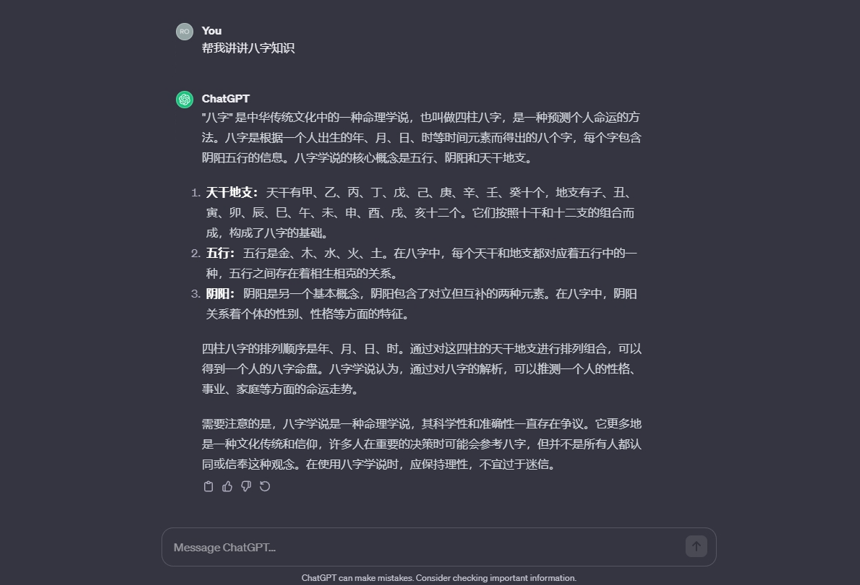
