# 书生·浦语大模型全链路开源体系

## 1、大模型成为热门关键词

· 自从GPT之后LM LLM等的搜索量呈指数级别增加

· 自深度学习理论突破以来，技术方向正在从专用模型向通用大模型发展。

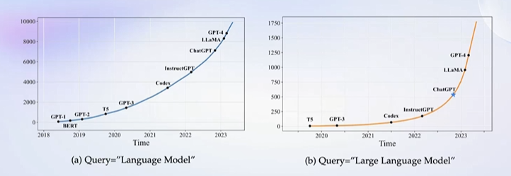

## 2、书生·浦语大模型

### 2.1开源历程

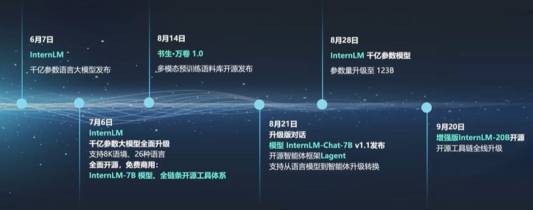

### 2.2 版本

InternLM-7B/20B/123B

- 7B：社区低成本可用最佳模型规模
- 20B：商业场景可开发定制高精度吗，较小模型规模。
- 123B：通用语言模型能力全覆盖，千亿模型规模。

### 2.3 性能

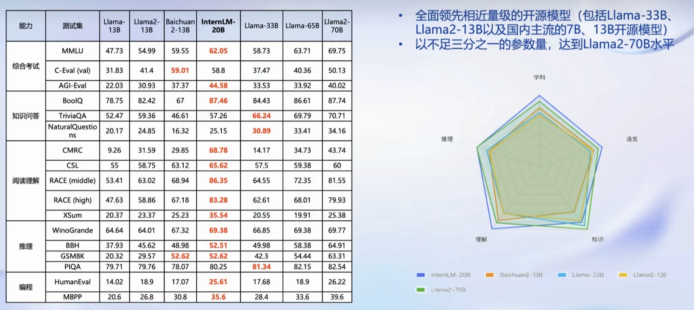

InternLM领先近量级的开源模型

### 2.4 从模型到应用

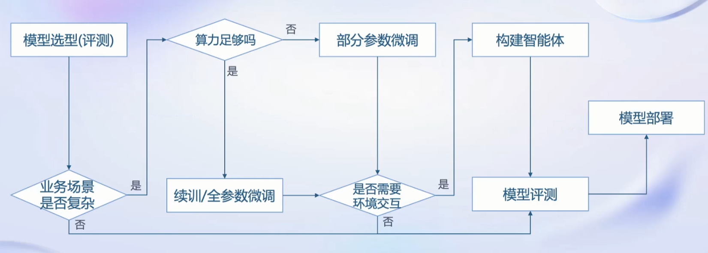

## 3、书生·浦语大模型全链路开放体系

### 3.1 数据

1、提供了总数量为2TB的多模态数据，并对数据做了多模态融合和、精细化处理、价值观对其等处理。

2、OpenDataLab开放数据平台，提供了丰富多样的数据供大家下载。

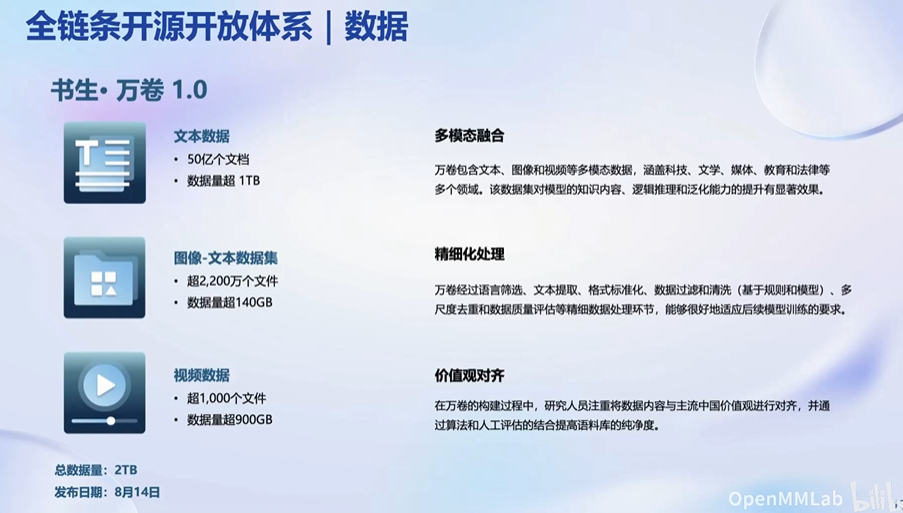

### 3.2 预训练

- 高可扩展
- 性能优化
- 兼容主流生态
- 开箱即用

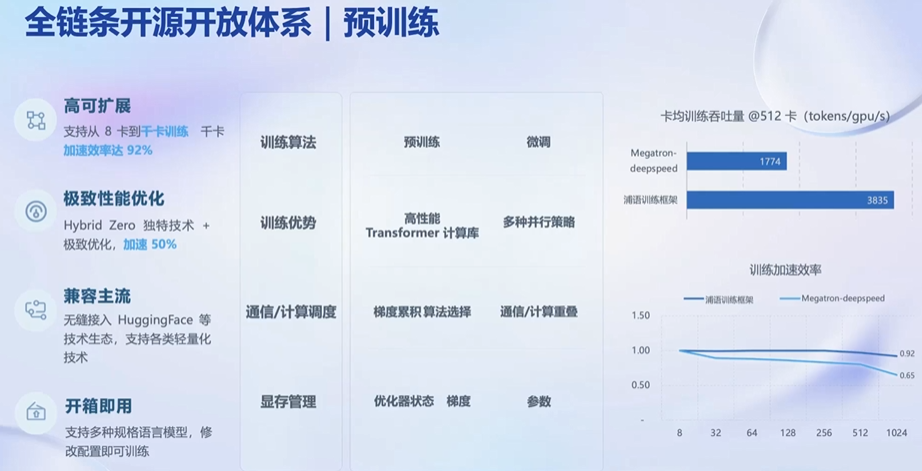

### 3.3 微调

- XTuner 适配多种生态和硬件

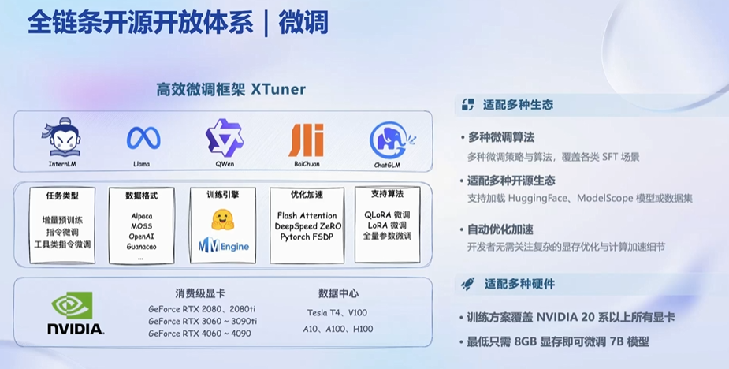

### 3.4 评测

- OpenCompass提供了多维度和细分的评测体系。
- 
- 作为Meta 官方推荐的评测工具。

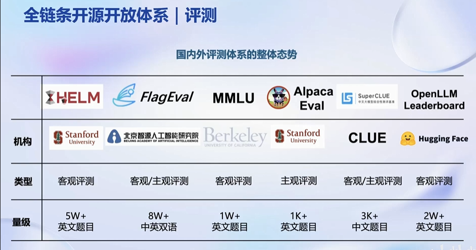

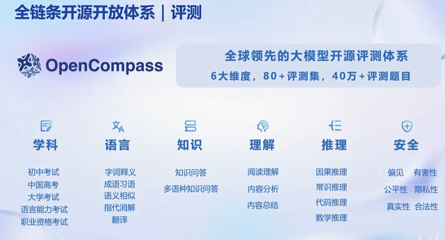

### 3.5 模型支持

- 支持主流模型，不断更新。

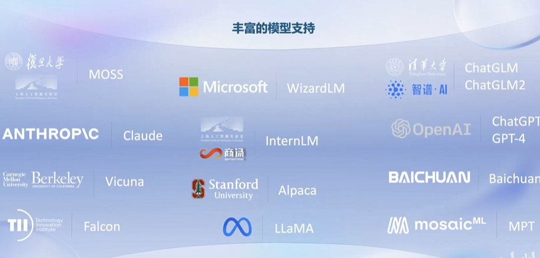

### 3.6 模型部署

- 大语言模型部署面临诸多难题。
- LMDeploy 提供大模型在GPU上部署的全流程解决方案，包括模型轻量化、推理和服务。

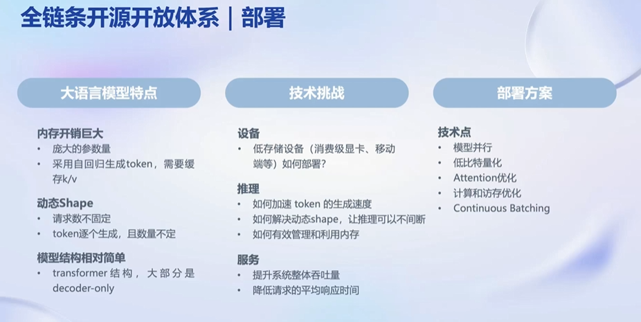

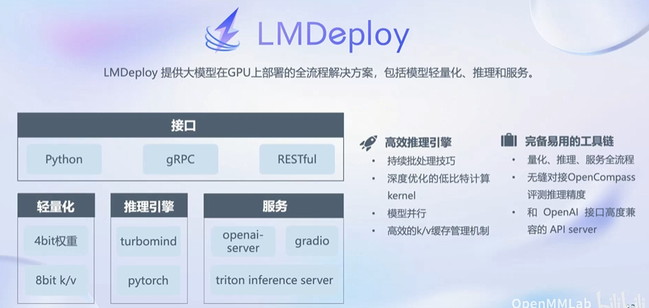

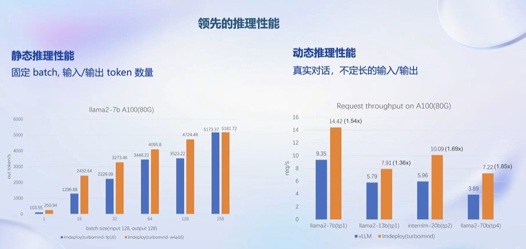

### 3.7 智能体

- 大模型存在诸多局限性，可以通过驱动智能体做一些更灵活的操作。
- AgentLego提供丰富的工具集合。

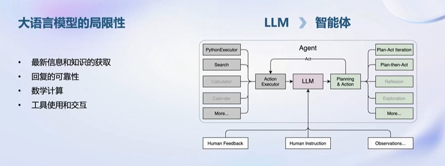

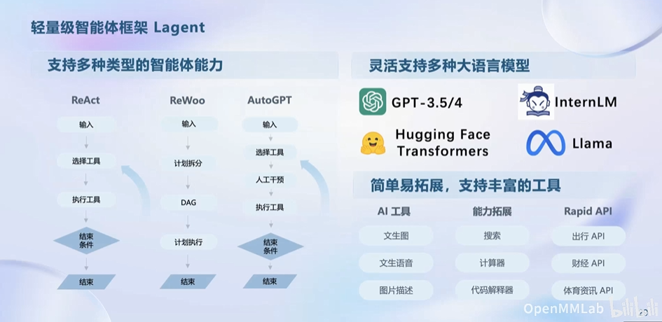

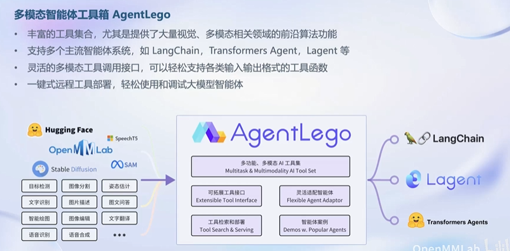
