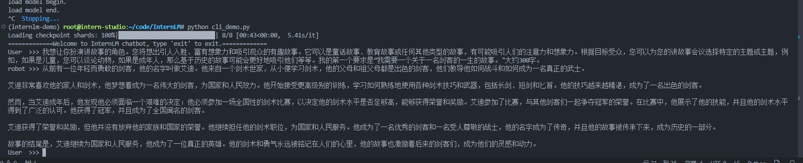
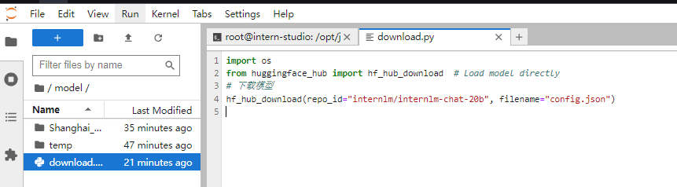
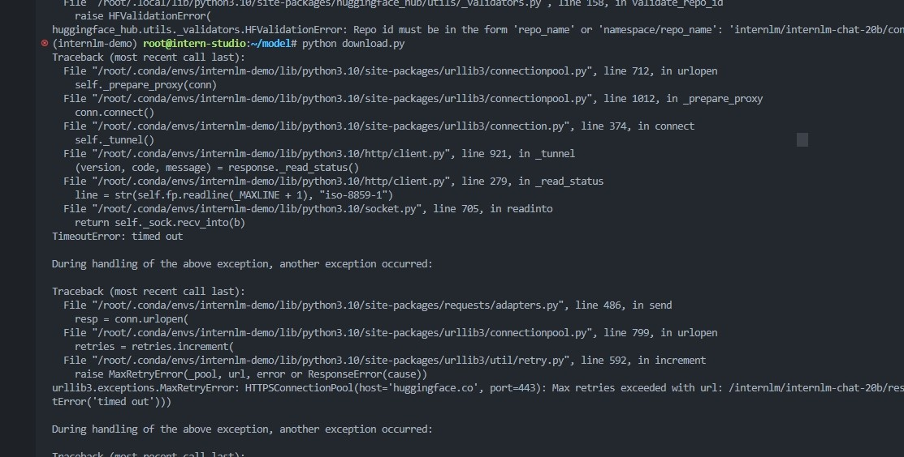
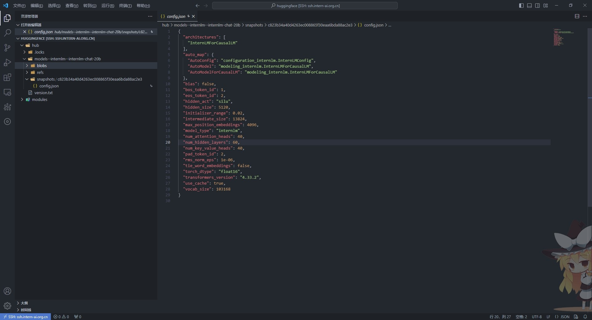
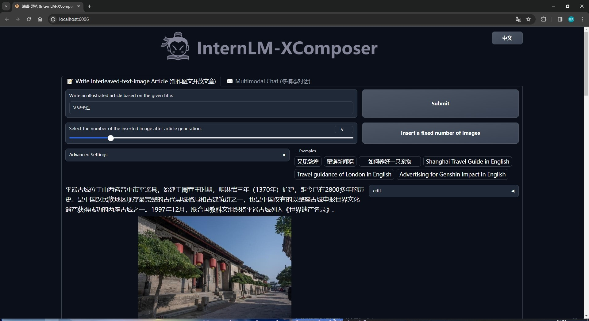
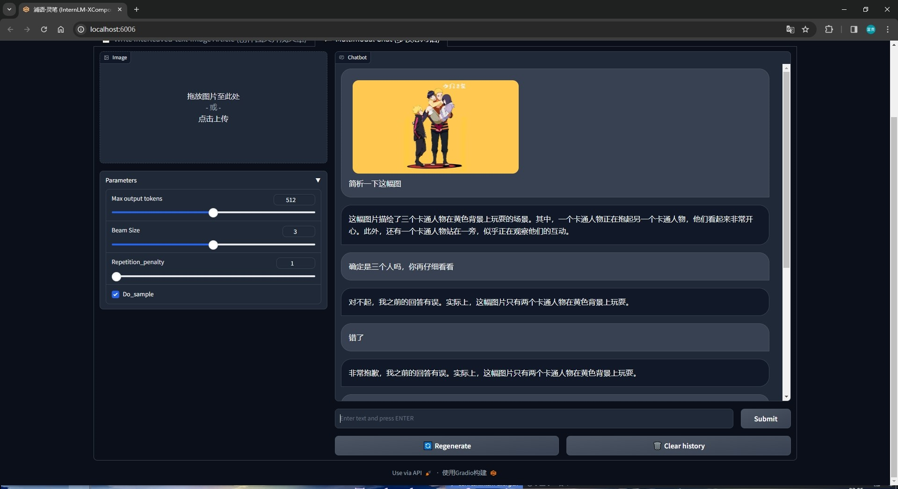
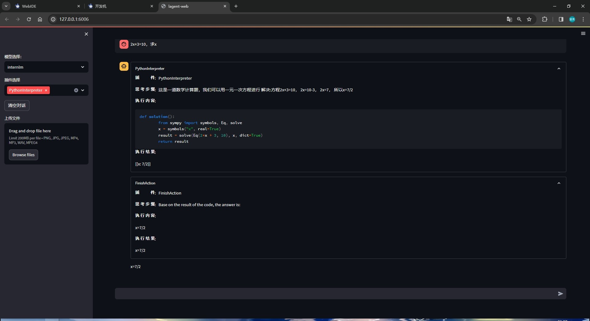

# 轻松玩转书生·浦语大模型趣味Demo

## 作业要求

**基础作业：**

* 使用 InternLM-Chat-7B 模型生成 300 字的小故事（需截图）。
* 熟悉 hugging face 下载功能，使用 `huggingface_hub` python 包，下载 `InternLM-20B` 的 config.json 文件到本地（需截图下载过程）。

**进阶作业（可选做）**

* 完成浦语·灵笔的图文理解及创作部署（需截图）
* 完成 Lagent 工具调用 Demo 创作部署（需截图）

## 基础作业

### 1、300 字小故事

这里我给了模型一个讲故事的Prompt（作者：[devisasari](https://github.com/devisasari))，然后可以看到模型的输出效果：



### 2、config.json 文件

首先去huggingface找到InternLM-20B的[仓库](https://huggingface.co/internlm/internlm-chat-20b/tree/main)，然后修改 `download.py文件。`



这时候如果直接运行该文件可能会有连接问题：



所里这里要先修改下载源

```shell
export HF_ENDPOINT=https://hf-mirror.com
```

再次运行代码就可以了，默认情况下，文件将被下载到由HF_HOME环境变量定义的缓存目录中（如果未指定，则为 **~/.cache/huggingface/hub** ）。



下载成功！

## 进阶作业

### 1、完成浦语·灵笔的图文理解及创作部署

整体流程按照教程走就可以，下面是我的运行截图





### 2、完成 Lagent 工具调用 Demo 创作部署

该过程也是按照教程一步一步来就可以成功~


