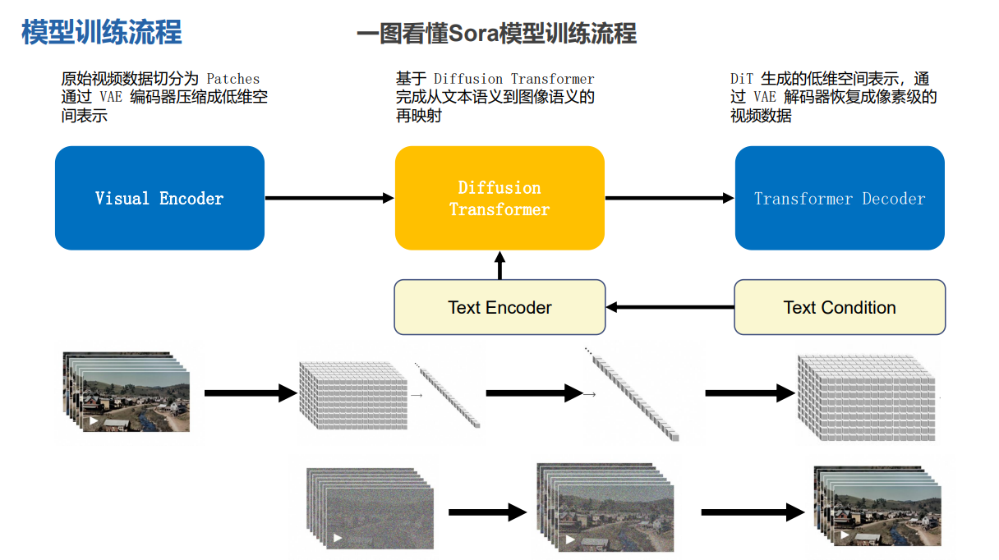
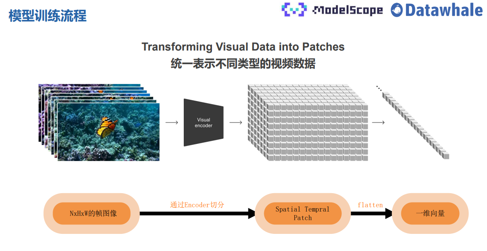
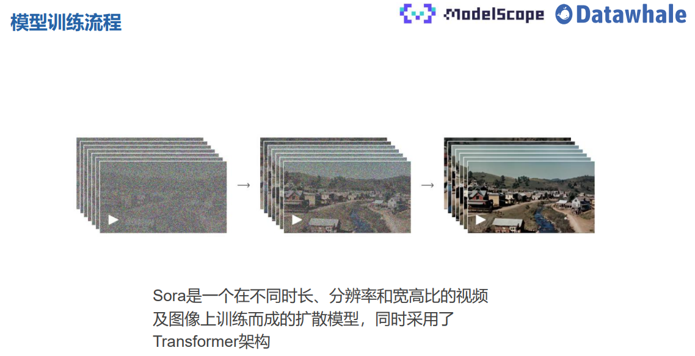
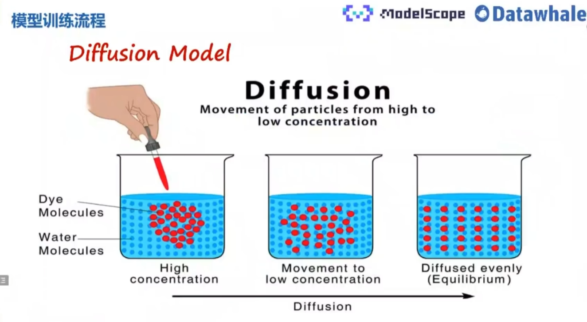
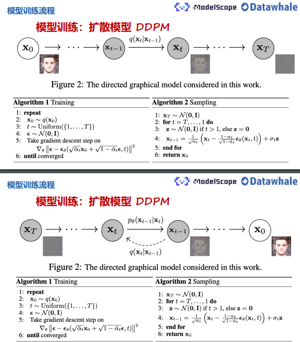
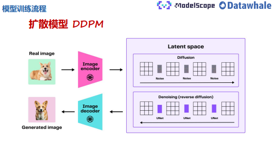
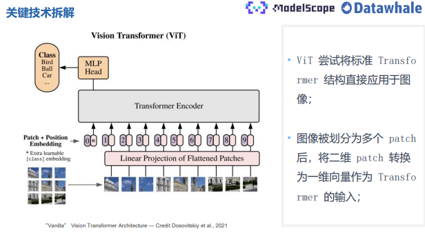

[toc]

# Sora技术原理详解

## Sora能力边界探索

Sora能力基本总结：

- Text-to-video: 文生视频
- Image-to-video: 图生视频
- Video-to-video: 改变源视频风格or场景
- Extending video in time: 视频拓展(前后双向)
- Create seamless loops: Tiled videos that seem like they never end
- Image generation: 图片生成 (size最高达到 2048 x 2048)
- Generate video in any format: From 1920 x 1080 to 1080 x 1920 视频输出比例自定义
- imulate virtual worlds: 链接虚拟世界，游戏视频场景生成Create a video: 长达60s的视频并保持人物、场景一致性

## Sora模型训练流程

### 总体训练流程

我们把Sora的模型训练分成三个模块Visual Encoder ->Diffusion Transformer->Transformer Decoder

1、Visual Encoder 把原始视频切分成一小块一小块的patch，然后通过一个VAE的编码器，压缩到前空间，然后再提取一些视频的特征。

2、基于 Diffusion Transformer完成从文本语义到图像语义的再映射，

3、DiT 生成的低维空间表示，通过VAE 解码器恢复成像素级的视频数据

### 统一数据输入

我们将NxHxW的图像输入到Encoder中，做成一个block，然后可以存储到Spatial和Tempral这样一个patch，包含了图像的时间和空间信息，最后做一个展开，展开成一维向量。

### Diffusion

官方的报告给出了：Sora是一个在不同时长、分辨率和宽高比的视频及图像上训练而成的扩散模型，同时采用了Transformer架构。

但是这个diffusion模型和我们传统的之前的模型的区别就是把diffusion里面的架构换成了Transformer架构，特别是U-Net架构

diffusion模型最开始来自2015年，简单来说这个扩散模型来自于一个非平衡热力学，它通过定义一个可以扩展步骤的马尔科夫链，缓慢的把符合高斯分布的噪声混合到数据中，然后从噪声中构建我们所需要的数据样本。

DDPM 改变了预测的过程，之前的模型是直接给定一张图预测下一张图，而DDPM改成了预测噪声，大大改进了diffusion模型的生成效果。

、

真实图片-> ImageEncoder ->Diffusion 添加噪声 -> Diffusion 去除噪声 ->ImageDecoder ->生成图片

## Sora关键技术拆解

ViT将Transformer运用到了图像。 

## 总结

1、Scaling Law：模型规模增大队视频生成质量的提升具有明确意义，

2、Data Engine：：数据工程很重要，如何获得更好的数据，OpenAI的Sora中的VAE流程是如何实现的？这是更加重要的关注点。

3、LLM：LLM大预言模型仍然是核心。
